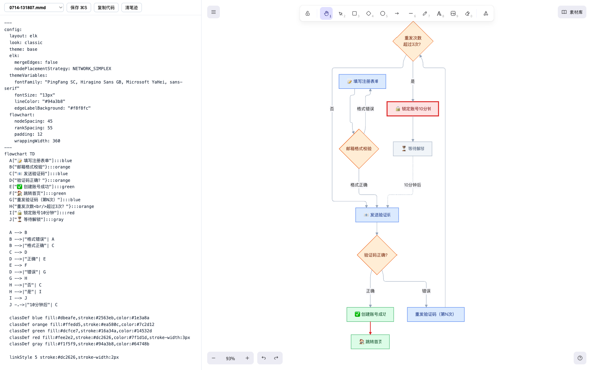

# mermaidfix

One command from plain language to a beautiful Mermaid diagram, on an Excalidraw canvas you can draw on.
一行命令,自然语言变漂亮 Mermaid 图,画板上直接标注。



**English** · [中文](#中文)

## Features

- **One-line CLI** — `mermaid <anything>`: natural language → AI generates a diagram; ugly Mermaid code → AI restyles it (semantics untouched, original kept as `*-raw.mmd`); a file path works too, and fenced ` ```mermaid ` blocks inside Markdown are extracted automatically.
- **Opinionated visual recipe** — ELK layout, classic look, light-fill/colored-stroke palette, red critical paths, dashed weak edges. No more hand-drawn scribble on white.
- **Instant feedback** — the browser opens immediately with a placeholder; the page polls and swaps in the finished diagram automatically (~8-14s with thinking disabled).
- **Self-healing render** — AI occasionally emits code that parses but crashes at render time (e.g. out-of-range `linkStyle`). The page detects it, sends code+error back to the AI for a minimal fix, and re-renders — automatic for disk-loaded content (once), manual "让 AI 修" button anytime. Your own mid-typing syntax errors are never auto-"fixed".
- **Live editor** — left pane edits code with 400ms re-render; syntax errors show in a bar without killing the last good render; ⌘S writes back to the `.mmd` file.
- **Excalidraw canvas** — the diagram sits as a locked base image on a real Excalidraw board: zoom, pan, draw, annotate, full toolbar. Annotations persist per-file across reloads. Key remap: `1`=hand, `2`=select, `3`=rect, `4`=diamond, `5`=ellipse.
- **Convert to editable** — one click turns the diagram into native Excalidraw elements: double-click to edit text, recolor, resize, drag nodes around (powered by the official mermaid-to-excalidraw).
- **History** — every run saved as a timestamped `.mmd`, switchable from a dropdown, with raw originals for comparison.
- **Ask-about-the-diagram chat** — a side drawer where you ask questions about the current diagram (flow logic, node relations, syntax). Answer-only by design: it has no editing power and redirects change requests to the editor/CLI. Streaming replies, multi-turn with per-file persistence, and a "think harder" toggle for tricky questions. The API key stays server-side (`serve.py` proxies `/chat`).

## Quick start

```bash
git clone https://github.com/humanai-labs/mermaidfix.git
cd mermaidfix
./install.sh                 # symlinks `mermaid` into ~/.local/bin, creates config.json
vi config.json               # fill in your API key (any OpenAI-compatible endpoint)
```

```bash
mermaid draw a login flow with retry and lockout   # natural language → diagram
mermaid "graph TD; A-->B; B-->C"                   # ugly code → restyled
mermaid ~/Desktop/diagram.mmd                      # file (also .md with mermaid blocks)
mermaid                                            # paste mode: paste anything, Ctrl-D
pbpaste | mermaid                                  # straight from clipboard
```

Config (`config.json`, git-ignored):

```json
{
  "endpoint": "https://api.deepseek.com",   // any OpenAI-compatible /v1/chat/completions
  "key": "sk-...",
  "model": "deepseek-chat",
  "browser": ""                              // e.g. "Google Chrome"; empty = system default
}
```

## Gotchas

- Text with parentheses/pipes/quotes gets mangled by your shell **before** the CLI sees it — use paste mode (`mermaid` + Enter) or a pipe. `install.sh` adds a zsh `noglob` alias that immunizes plain parentheses.
- The visual recipe uses `layout: elk`, which GitHub's Mermaid renderer doesn't support — delete that line when pasting into GitHub.
- Excalidraw & the converter load from CDN (jsdelivr / esm.sh); first load needs network.
- "Convert to editable" makes a detached copy — canvas edits don't write back to the code. "重置画板" (reset board) returns to code-rendered mode.
- `enable_thinking: false` is sent to speed up DeepSeek-style reasoning models; other gateways simply ignore the unknown field.

---

## 中文

### 功能

- **终端一行命令** — `mermaid <任意输入>`:自然语言 → AI 生成;丑 mermaid 代码 → AI 视觉美化(语义不动,原稿存 `*-raw.mmd`);支持拖文件、自动抽取 Markdown 里的 ` ```mermaid ` 代码块。
- **内置视觉配方** — ELK 布局 + classic 外观 + 浅底彩边色板 + 关键路径标红 + 弱关系虚线,frontmatter 优先级高于编辑器手绘开关。
- **即时反馈** — 命令一敲浏览器立刻打开占位图,页面轮询自动换成品(关思考链后约 8-14 秒)。
- **实时编辑器** — 左改代码右侧 400ms 重渲;语法错误弹红条、保留上一张好图;⌘S 保存回 `.mmd`。
- **Excalidraw 画板** — 图作为锁定底图,缩放/平移/全套画笔标注;笔迹按文件持久化;数字键重映射:`1`=拖拽手 `2`=选择 `3`=矩形 `4`=菱形 `5`=圆。
- **转可编辑** — 一键把图转成原生画板元素:双击改字、改色、改字号、拖动节点(官方 mermaid-to-excalidraw)。
- **历史留存** — 每次运行存时间戳 `.mmd`,页面下拉可切历史与 raw 原稿对照。
- **对话解惑** — 右侧抽屉针对当前图提问(流程含义/节点关系/语法);**只答不改**,要改图它会指路编辑器或 CLI。流式回答、多轮记忆按文件持久化、「深想」开关应对难题;key 只在服务端(`serve.py` 代理 `/chat`)。
- **渲染自愈** — AI 偶发产出"能解析、渲染才崩"的代码(如 linkStyle 越界);页面检测到后自动把代码+报错回炉给 AI 最小修复并写回(磁盘内容限一次),错误条上有「让 AI 修」手动按钮;你手动编辑中的语法错误不会被自动"修"。

### 快速开始

```bash
git clone https://github.com/humanai-labs/mermaidfix.git
cd mermaidfix
./install.sh          # symlink 到 ~/.local/bin,生成 config.json
vi config.json        # 填 API key(任何 OpenAI 兼容端点)
```

用法示例见上方英文段;`mermaid -h` 查看完整说明。

### 注意事项

- 含括号/管道/引号的文本会先被 shell 拆参数——走**粘贴模式**(裸敲 `mermaid` 回车再粘贴)或管道;install.sh 已为 zsh 配 `noglob` 别名。
- 配方里的 `layout: elk` GitHub 渲染器不支持,贴 GitHub 时删掉那行。
- Excalidraw 与转换库走 CDN,首次加载需联网。
- 「转可编辑」是脱钩拷贝,画板改动不写回代码;「重置画板」回到代码渲染模式。

## License

Apache-2.0
